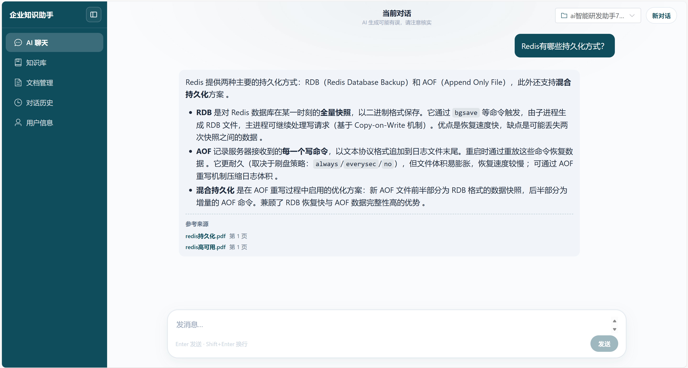
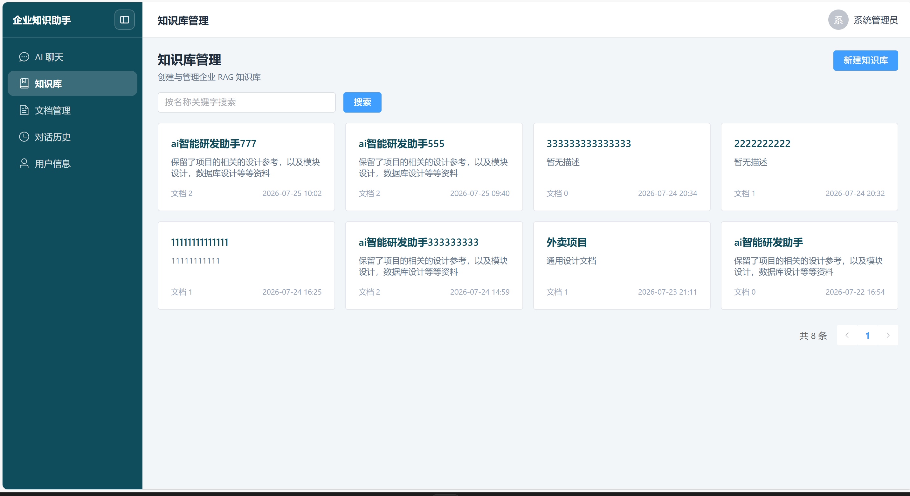
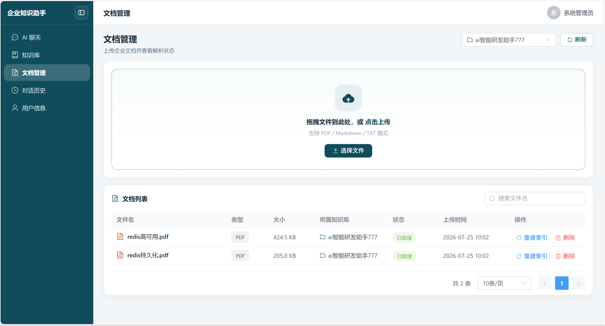

# AI Enterprise Knowledge Platform

基于 RAG + Workflow 架构的企业级知识助手平台。

面向企业内部技术文档、Wiki、接口文档等知识管理场景，
实现从文档解析、向量检索、上下文管理到大模型生成的完整 AI 应用链路。

核心能力：

- RAG 知识增强问答
- Workflow 流程编排
- 多轮上下文 Memory
- Citation 来源追踪
- Trace 链路观测
- LLM Fallback 降级
---

## 🌐 Online Demo

项目已完成云服务器部署。

访问地址：

[Online Demo（点击访问）](http://106.55.103.123)

由于系统依赖第三方 LLM API 服务，Demo 暂未开放公开注册。

测试账号将在面试或技术交流时提供。

---

## 📖 项目介绍

在企业研发过程中，大量技术文档、接口文档、Wiki 等知识分散存储，传统关键词搜索难以理解用户语义，导致研发人员需要在大量文档中反复查找。

本项目面向企业内部知识管理场景，构建了一套基于 RAG（Retrieval-Augmented Generation，检索增强生成）的 AI 知识助手系统。

用户可以上传企业文档，系统经过：

```
文档解析
↓
文本分块
↓
Embedding向量化
↓
知识库存储
↓
语义检索
↓
LLM生成回答
```

---

## ⭐ 项目亮点

- 基于 RAG + Workflow 构建企业知识问答链路，实现从文档解析、检索增强到 LLM 生成的完整 AI Pipeline
- 基于 Redis Stack + RediSearch Vector 实现向量检索，并结合 Metadata Filter 实现知识库级别的数据隔离
- 设计 WorkflowContext 管理 Query Rewrite、Memory、Retrieval、Generation 等节点状态，降低多节点流程耦合
- 实现 Citation 来源追踪，提高生成结果可解释性
- 实现 Trace 链路追踪、RAG Evaluation、LLM Fallback，提高系统可观测性与稳定性

---

## ✨ 核心功能 (V1 已完成)

### 🖥️ 前端交互

- Vue3 前端页面
- 知识库管理界面
- 文档上传交互
- AI 对话页面
- Markdown回答渲染
- Citation引用展示

### 📄 文档与知识库管理

- 知识库创建与管理
- 企业文档上传
- PDF / Markdown / TXT 文档解析
- 文档自动分块 Chunking
- 文档 Embedding 向量化并写入 Redis Vector Store

### 🔍 RAG 检索链路

- Embedding 向量生成
- Redis Vector 向量数据库存储
- 基于语义相似度的知识检索
- Metadata Filter 精确过滤

### 💬 智能问答

- Query Rewrite 查询重写
- 多轮对话上下文 Memory
- 基于知识库增强回答
- Citation 引用来源返回

### 🔐 基础系统能力

- 用户认证
- REST API 接口设计
- 模块化业务架构

---

## 🏗️ 系统架构

```
                    User
                     |
                    Vue3
                     |
             Spring Boot API
                     |
             Workflow Engine
                     |
   +-----------------+----------------+
   |                 |                |
Memory Node     Retrieval Node    Generate Node
   |                 |                |
 Redis          Vector Store        LLM
                     |
                 Citation
                     
        Trace System (贯穿全链路)
```

---

## 📄 文档处理流程

```
用户上传文档
 ↓
Document Parser (PDF / Markdown / TXT)
 ↓
Chunk Service (文本分块)
 ↓
Embedding Model
 ↓
Redis Vector Store
 ↓
企业知识库
```

---

## 🎬 系统展示

### AI问答



### 知识库管理



### 文档管理



## 🛠️ 技术栈


| 模块          | 技术选型                     |
| ----------- | ------------------------ |
| 前端框架        | Vue3                     |
| 构建工具        | Vite                     |
| UI组件        | Element Plus             |
| HTTP请求      | Axios                    |
| 后端框架        | Spring Boot              |
| 开发语言        | Java 17                  |
| ORM框架       | MyBatis Plus             |
| AI框架        | LangChain4j              |
| 大语言模型       | Qwen                     |
| Embedding模型 | text-embedding-v3        |
| 数据库         | MySQL                    |
| 缓存          | Redis                    |
| 向量检索        | Redis Stack + RediSearch |
| API测试       | Postman                  |


---

## 📊 Project Statistics

- Backend: Spring Boot 3 + Java 17
- Frontend: Vue3 + TypeScript
- AI Pipeline: RAG + Workflow
- Storage: MySQL + Redis Stack
- Deployment: Cloud Server + Docker
- Modules: 10+
- Supported Documents:
  - PDF
  - Markdown
  - TXT

---

## 📂 项目结构

本项目采用前后端分离架构：

- 后端：Spring Boot + MySQL + Redis + RAG
- 前端：Vue3 + Vite

目录结构如下：

```text
AI-Enterprise-Knowledge-Platform
├── backend
│   └── AiConsultant
│       ├── common
│       ├── chat
│       ├── document
│       ├── knowledge
│       ├── llm
│       ├── memory
│       ├── rag
│       └── workflow
│
├── frontend
│   ├── views
│   ├── components
│   ├── api
│   └── stores
│
├── docs
└── README.md
```

---

## 🧩 Engineering Challenges

### 1. 多节点流程参数管理

**问题**：
RAG流程包含：Query Rewrite、Memory、Retrieval、Generation 多个节点，节点之间需要共享流转数据。

**方案**：
设计 `WorkflowContext` 上下文对象，统一承载全流程流转数据。

```
WorkflowContext
- query
- rewriteQuery
- history
- documents
- traceId
- response
```

### 2. LLM 稳定性

**问题**：
调用第三方大模型服务，存在超时、限流、报错等服务失败风险。

**方案**：
实现主模型+降级模型的容错链路，失败自动重试，重试失败切换兜底模型，同时记录降级链路 Trace 用于问题排查。

```
Primary Model
      |
失败重试
      |
Fallback Model
```

### 3. 检索效果评估

**问题**：
RAG 效果不能只靠人工肉眼观察主观判断，需要可量化指标做客观评测。

**方案**：
构建标准测试集 `golden dataset`，通过检索指标量化召回质量。

计算指标：

- Recall@K
- MRR
- Hit Rate

---

## 🚀 Production Deployment

项目已完成云服务器部署，并通过公网访问验证。

### 部署环境


| 模块        | 技术选型                    |
| --------- | ----------------------- |
| 操作系统      | Ubuntu 22.04 LTS        |
| 容器化       | Docker + Docker Compose |
| 后端服务      | Spring Boot             |
| 前端服务      | Vue3 + Nginx            |
| 数据库       | MySQL 8.0               |
| 缓存 / 向量存储 | Redis Stack             |
| 部署方式      | 云服务器部署                  |


### 系统部署架构

```
服务器环境准备
↓
Docker 安装
↓
Docker Compose 启动 MySQL / Redis
↓
Spring Boot 后端部署
↓
Vue3 前端构建部署
↓
公网访问验证
```

### 已完成部署能力

- [x] 云服务器部署
- [x] Docker 容器化运行 MySQL
- [x] Docker 容器化运行 Redis Stack
- [x] Spring Boot 后端线上运行
- [x] Vue3 前端线上部署
- [x] RAG 核心链路线上环境验证
- [x] 数据库持久化配置
- [x] Redis Vector Store 正常运行

### 生产环境说明

生产环境需显式启用 `prod` profile：

```bash
SPRING_PROFILES_ACTIVE=prod
```

此时会加载 `application.yml` + `application-prod.yml`（后者覆盖 Redis / DB 等连接配置）。

敏感配置通过服务器环境变量注入（不要依赖仓库里的 `.env`），变量名可参考：

`backend/AiConsultant/.env.example`

---

## 🚀 快速启动

### 1. 环境要求

- Java 17+
- MySQL 8+
- Redis 7+（本地向量检索建议 Redis Stack）

### 2. 环境配置

**Clone 后默认走本地配置**：只加载 `application.yml`（MySQL / Redis 默认 `localhost`），**不会**自动启用 `application-prod.yml`。

首次本地运行前，复制并填写 `.env`：

```bash
cd backend/AiConsultant
cp .env.example .env
```

本地 `.env` 至少填写：

- `API_KEY` / `EMBEDDING_API_KEY`
- `DB_USERNAME` / `DB_PASSWORD`
- `JWT_SECRET_KEY`

启动时 `LocalDotenvBootstrap` 会把 `.env` 读入环境，供 `application.yml` 中的 `${...}` 占位符使用。

本地 `.env` 中**不要**设置 `SPRING_PROFILES_ACTIVE=prod`，否则会按生产配置连接远程库。

### 3. 后端启动

进入后端项目目录 

```bash
cd backend/AiConsultant
```

启动：

```bash
mvn spring-boot:run
```

### 4. 前端启动

进入前端项目目录

```bash
cd frontend
```

安装依赖：

```bash
npm install
```

启动：

```bash
npm run dev
```

---

## 🔌 API 示例

当前提供 REST API，可通过 Postman 调试。

**请求接口：**

```http
POST /api/v1/chat
```

**请求入参：**

```json
{
  "conversationId": 1,
  "message": "Redis有哪些持久化方式？"
}
```

**返回结果：**
成功返回答案以及 Citation 引用信息

```json
{
  "code": 1,
  "data": {
    "answer": "Redis主要有RDB和AOF两种持久化方式...",
    "reference": [
      {
        "documentId": 2080836111764529154,
        "documentName": "redis持久化.pdf",
        "page": 1,
        "content": "redis持久化..."
      }
    ]
  }
}
```

---

## 🧪 测试记录

完整 RAG 链路测试记录：

包含：

- 文档上传测试
- 检索测试
- 多轮对话 Memory 测试
- Citation 返回测试

详情：

[docs/test/V1-test.md](docs/test/V1-test.md)

---

## ✅ 当前状态

目前已完成前后端完整链路：

- 企业知识库管理
- 文档解析与向量化
- RAG增强检索
- 多轮对话Memory
- Citation引用返回
- Vue前端交互页面

支持本地部署运行。

---

## 🗺️ Roadmap

### V1.0 - RAG 基础能力 ✅

- [x] 用户认证
- [x] 知识库管理
- [x] 文档上传与解析
- [x] Chunk文本分割
- [x] Embedding向量化
- [x] Redis Vector检索
- [x] Query Rewrite
- [x] Short-term Memory
- [x] Citation引用来源
- [x] REST API
- [x] Vue 前端基础交互界面

### V2 阶段 (进行中)

- [x] Trace 链路日志追踪
- [x] RAG Evaluation 检索效果评估
- [x] Fallback 大模型降级策略
- [ ] Long-term Memory 长期记忆
- [ ] 完善 Docker Compose 部署方案

### V3.0 - Advanced AI Application （计划）🚀

- [ ] Semantic Chunking 语义切片优化
- [ ] Hybrid Retrieval Optimization 混合检索优化
- [ ] Online Evaluation 在线效果监控
- [ ] Prompt Management 提示词管理
- [ ] Agent Workflow 探索